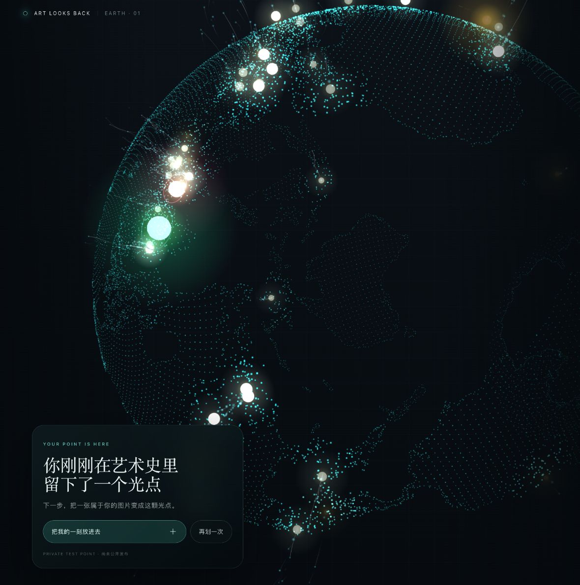

# GC Art History Particle Play

Turn a particle globe or art-history atlas into a mobile-first play, personalize, moderate, publish, and share loop.

This Codex Skill was created for **ART LOOKS BACK / Art History Twin**, but its product contracts can be reused by other cultural WebGL experiences.

## Effect preview



*Particle Earth → first gesture → one personal moment. The image shows the private test entrance; public publishing remains moderation-gated.*

## What it helps with

- Put the particle Earth on the first screen and make it playable in under three seconds.
- Design one coherent gesture: pull or tear, gather, reveal, burst, return.
- Let visitors create an immediate private preview and local poster from one image and one short line.
- Start authoritative server-side moderation only after an explicit public-publish request.
- Produce a point-specific deep link and an optional four-second vertical share loop.
- Audit the real mobile route, reduced-motion fallback, and publication boundary.

## Install

Clone the repository into your Codex skills directory:

```bash
mkdir -p ~/.codex/skills
git clone https://github.com/joeyhu1108-maker/gc-art-history-particle-play.git \
  ~/.codex/skills/gc-art-history-particle-play
```

Restart Codex if the Skill is not discovered immediately.

## Use

Invoke it explicitly:

```text
Use $gc-art-history-particle-play to turn this particle-globe experience into an immediate mobile play loop with private preview and local poster download, explicit moderation-gated public publishing, and a moment-specific share artifact.
```

It supports four working modes:

- `strategy` — define the smallest viral loop and safety boundary.
- `prompt` — produce an implementation brief for another builder.
- `implementation` — inspect and surgically change a real project, then verify the route.
- `audit` — diagnose why an existing particle effect is watched but not played or shared.

## Package

```text
.
├── SKILL.md
├── agents/
│   └── openai.yaml
└── references/
    ├── moderation.md
    └── viral-loop.md
```

`SKILL.md` is the source of truth. The references keep the public-growth loop and moderation requirements focused without bloating the main instructions.

## Safety contract

Uploads may receive a private preview and on-device poster immediately. Moderation starts only when the user explicitly requests public publishing, and only approved published records may appear in public queries, public media, downloadable public clips, deep links, or friend-continuation flows. This Skill is product and implementation guidance, not legal advice; verify current moderation-provider capabilities and applicable obligations before launch.

## License

[MIT](LICENSE)
